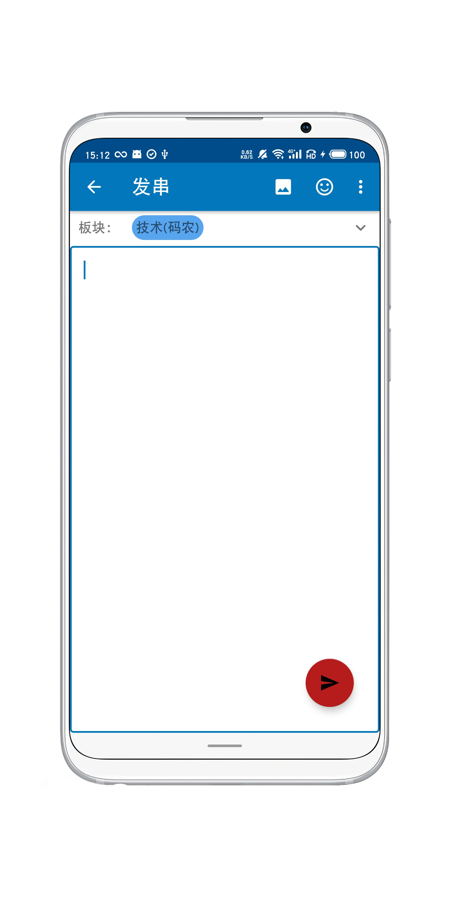

这是完全由kotlin编写的[A岛匿名版](https://adnmb3.com/Forum)安卓客户端，app的架构遵守了开发指南所推荐的[MVVM架构](https://developer.android.com/jetpack/guide#recommended-app-arch),并且使用了Hilt,  Coroutines, Flow, Jetpack (Room, ViewModel, LiveData) 等多种组件。

## 截图

## 功能
1. 发串与回复
2. 自定义屏蔽项
3. 自定义布局（现仅限于FAB设置）
4. 导入饼干（二维码，用户系统）
5. 收藏串

## 待实现
1. 自定义主题颜色
2. 串内图片滑动浏览
3. 根据反馈加入实用功能
4. 优化性能

## 依赖
| 功能 | 依赖          |
|------|---------------|
| 列表 | [recyclerview](https://developer.android.com/guide/topics/ui/layout/recyclerview) |
|数据库|[room](https://developer.android.com/training/data-storage/room)|
|进度条|[SpinKit](https://github.com/ybq/Android-SpinKit)|
|手绘|[AndroidDraw](https://github.com/divyanshub024/AndroidDraw)|
|依赖注入|[Hilt](https://developer.android.com/training/dependency-injection/hilt-android)|
|HTML解析|[Jsoup](https://github.com/jhy/jsoup)|
|网络|[Retrofit](https://github.com/square/retrofit)|
|页码|[paging](https://developer.android.com/topic/libraries/architecture/paging/v3-overview)|
|图片|[Glide](https://github.com/bumptech/glide)|
|navigation|[navigation](https://developer.android.com/guide/navigation)|
|图片手势|[PhotoView](https://github.com/Baseflow/PhotoView)|
|preference|[datastore](https://developer.android.com/topic/libraries/architecture/datastore)|
|二维码|[zxing-android-embedded](https://github.com/journeyapps/zxing-android-embedded)|
|json|[gson](https://github.com/google/gson)|
|图片压缩|[compressor](https://github.com/zetbaitsu/Compressor)|
|webview|[webkit](https://developer.android.com/guide/webapps/webview)|
|viewmodel|[viewmodel](https://developer.android.com/topic/libraries/architecture/viewmodel)|
|livedata|[livedata](https://developer.android.com/topic/libraries/architecture/livedata)|

